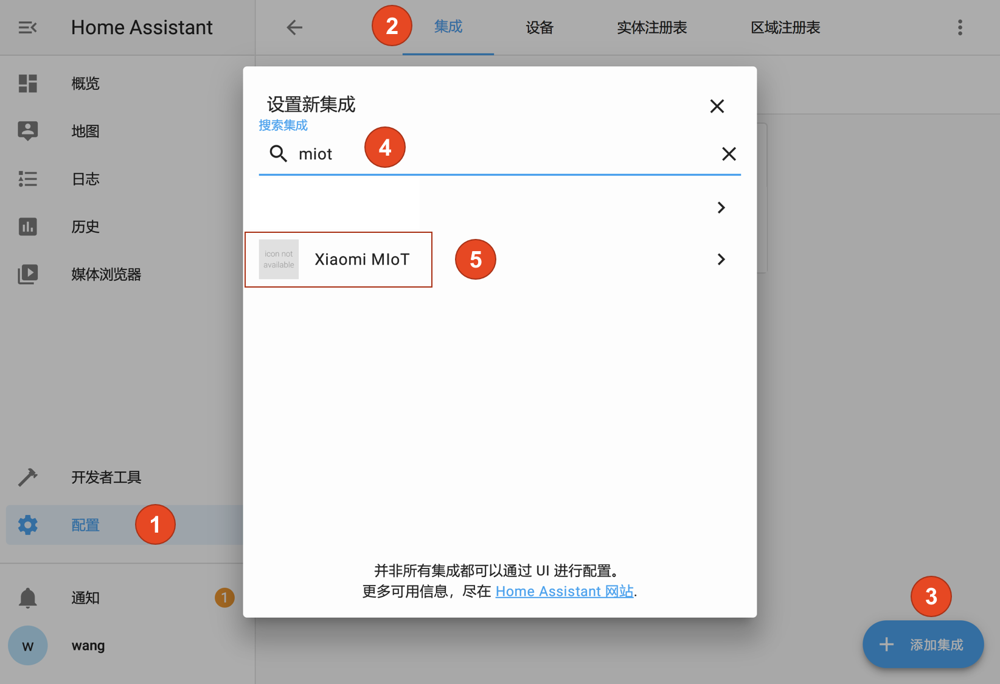

# Xiaomi MIoT

简体中文 | [English](https://github.com/ha0y/xiaomi_miot_raw/blob/add-miot-support/README_en.md)

## 介绍

MIoT 协议是小米智能家居从 2018 年起推行的智能设备通信协议规范，此后凡是已接入米家的设备均可通过此协议进行通信。此插件按照 MIoT 协议规范与设备或服务器通信，实现对设备的状态读取及控制。

由于 MIoT 协议具有极强的通用性，已接入米家的智能设备均可通过此插件快速高效地接入 Home Assistant，而无关设备的具体型号。

本插件具有本地（局域网）和云端两种工作方式。两种方式结合，可以接入绝大多数米家智能设备(包括蓝牙、蓝牙 Mesh 和 ZigBee 设备)。

如果对您有帮助，欢迎给个 Star！🌟  
欢迎加入 MIoT 插件交流群，在这里您不仅可以快速地得到插件相关问题的解答，还可与大家交流智能家居心得，畅所欲言！  
1 群： **982 100 289**（已满）  2 群： **789 221 593**

## 安装或升级

以下两种安装/升级方法，选择其中一种即可。请不要使用一种方法安装然后用另一种方法升级，可能导致问题。

### 通过 HACS 自动安装

1. 打开 Home Assistant 的 HACS 页面。
2. 点击`集成`。
3. 点击右下角的`浏览并添加存储库`。
4. 在新打开的页面中找到`Xiaomi MIoT`，安装即可。
5. 重新启动 Home Assistant。

**如需升级：在您打开 HACS 页面时，会自动出现升级提示。按照提示操作即可。**

### 手动安装
1. 下载插件 zip 压缩包。
2. 打开压缩包中的`custom_components`文件夹。
3. 将该文件夹中的`xiaomi_miot_raw`文件夹拷贝至自己 HA 安装目录的`custom_components`文件夹。
4. 重新启动 Home Assistant。

**如需升级：下载最新版插件压缩包后，按照上述方法，覆盖原有文件即可。**


## 使用方法
**本插件已实现全面 UI 化，所有配置均可通过 UI（网页端）完成，无需您编辑配置文件。**  
对本插件进行配置有以下两种途径：
1. 点击集成页面右下角的`添加集成`，然后选择`Xiaomi MIoT`。如果您想要登录账号、添加设备，请使用此途径。
2. 在集成页面找到已添加的设备/账号，然后点击`选项`。如果您想要修改账号地区、修改已添加设备的选项，请使用此途径。
---
**首次使用建议您先登录小米账号。**

<details>
<summary>登录小米账号的方法，请点击查看</summary>




</details>

**登录账号后，再次通过`途径 1`进入插件，即可选择要添加的设备。**
<details>
<summary>图片步骤说明</summary>


</details>

**如需添加多个传感器设备，使用此方法会更加快捷：**
<details>
<summary>批量添加设备步骤说明</summary>


</details>

**对设备进行细微调整，使之更适合您的实际情况：**
1. 对于所有类型的设备，指示灯和童锁的开关默认是隐藏的。您可以通过`途径 2`启用它们。
2. 对于空调类实体，可以指定一个温度传感器作为该空调实体的温度来源。您可以通过`途径 2`来设置。
3. 对于卷帘类实体，如果出现上/下位置颠倒的情况，您可以通过`途径 2`来反转位置。注：此功能只改变 HA 的显示，不会反转电机方向。
4. 设备的部分选项（如模式）支持删除或修改名称，例如将风扇的模式修改为中文。您可以在`途径 1`添加设备时，修改“配置参数”来实现。

## 技术支持
如果在插件使用上遇到问题，可加入 QQ 群，大多数问题并非插件本身的问题，在 QQ 群中能更快地得到解答。若是插件存在 Bug，可通过 GitHub 的 Issue 功能提交问题，这样便于跟踪。

在某些情况下，插件作者可能需要您提供更为详细的调试日志。启用详细日志的方法是：

```yaml
# configuration.yaml

logger:
  default: warn
  logs:
    custom_components.xiaomi_miot_raw: debug
    miio: debug
```
