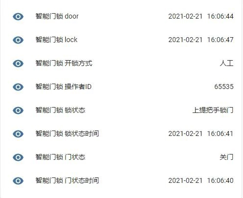

# Xiaomi MIoT

简体中文 | [English](https://github.com/ha0y/xiaomi_miot_raw/blob/add-miot-support/README_en.md)

---
### 2021.3.30 现已支持智能门锁！



<a href="https://github.com/ha0y/xiaomi_miot_raw/blob/master/images/donation.png">
    
</a>

---

MIoT 协议是小米智能家居从 2018 年起推行的智能设备通信协议规范，此后凡是可接入米家的设备均通过此协议进行通信。此插件按照 MIoT 协议规范与设备通信，实现对设备的状态读取及控制。

由于 MIoT 协议具有极强的通用性，已接入米家的智能设备均可通过此插件快速高效地接入 Home Assistant，而无关设备的具体型号。

本插件运行方式默认为本地接入(局域网读取/控制)，延迟极低。**对于不支持本地读取的设备，支持 2 种云端接入（云端读取本地控制/云端读取云端控制）。**

目前此插件已支持以下设备类型：
* sensor (传感器类设备，涵盖设备所有可读取的信息)
* switch (开关/插座及其他所有可以开关的设备)
* light (灯，包括吸顶灯/风扇灯/台灯/设备的指示灯，~~等灯等灯~~)
* cover (电机类设备，卷帘/晾衣架/升降帘/窗帘)
* fan (风扇)
* humidifier (加湿器/除湿器)
* media player (小爱音箱，可以播放/暂停/调音量，上一曲/下一曲，TTS/执行自定义指令)
* climate (空气调节类设备，空调/空调伴侣/电暖气)
* water heater (热水器/电水壶/洗碗机)
* 部分智能门锁
* 其他不能按照 HA 的设备类型分类的设备 (洗衣机、咖啡机、鱼缸等等)

如果对您有帮助，欢迎给个 Star！ 🌟

如果插件工作不正常，请先参考[调试](https://github.com/ha0y/xiaomi_miot_raw#调试)部分，打开调试日志，通过日志排查问题。

如果您认为插件有 bug，或者有新功能的想法，或者您的设备没有支持，您可以提交 Issue。
使用上的问题，请在论坛咨询，或加入 QQ 群: **982 100 289**

## 安装

* 将 custom_component 文件夹中的内容拷贝至自己的相应目录

或者
* 在 [HACS](https://hacs.xyz/) 商店中，直接搜索添加“[Xiaomi MIoT](https://github.com/ha0y/xiaomi_miot_raw)”


## 配置

### UI 配置法
<details>
<summary>登录账号</summary>


</details>

<details>
<summary>逐一自动添加设备（推荐）</summary>


</details>

<details>
<summary>批量添加设备（建议用来添加非 WiFi 设备）</summary>


</details>


### 文件配置法

**请参考 [config_example 文件夹](https://github.com/ha0y/xiaomi_miot_raw/tree/add-miot-support/config_example)** 内的相关文件

## 常见问题
**安装以后，搜索不到集成？**

确保安装后已重启 Home Assistant。由于浏览器缓存原因，可能仍然不能搜索到集成，请尝试清空浏览器缓存。如果仍然无效，尝试通过其他浏览器进行配置。

**提示设备不受支持，怎么办？**

不要灰心。绝大多数已接入米家的设备都是可以支持的，只是作者还没有适配。请提交 Issue，附上设备的 model。同时请加入 QQ 群，如果作者遇到问题需要进一步提供信息，会通过 QQ 联系你。

**为什么不支持摄像机？**

本插件是一个“通用插件”，因此极少包含与特定设备有关的代码。而小米仅仅未对摄像机的标准进行统一，设备厂商各行其是。经过逆向小爱音箱上的“米家”APP 发现，即使是这样一个功能残缺的客户端，为了实现摄像机的播放，也集成了所有摄像机设备厂商的 SDK。因此可以认为，摄像机各家厂商的标准、协议、通信都不统一，无法做到通用适配。因此摄像机无法支持。

**本插件能否实现“断网联动”？**

如果设备未通过云端接入（读取、控制均不走云端），通过本插件接入的设备在断网条件下可以正常被读取和控制。如果使用了云端接入，则不可以。（注：断网指的是断开互联网，局域网正常。局域网若中断则所有设备均不能工作。）

## 更新日志
### 4 月 5 日
1. 支持鱼缸。
2. 修复 cover 状态反馈不正确的问题。

### 4 月 2 日
1. 修复本地设备状态经常出现“不可用”的问题。
2. 优化新设备的默认名称。
3. 支持批量添加设备（实验中）

### 3 月 30 日
1. **支持门锁！**

### 3 月 26 日
1. 优化代码结构。
2. 优化状态属性显示。
3. 优化添加设备体验。
4. 修复部分热水器不可用问题。

### 3 月 23 日
1. 修复部分设备支持本地读取但读取失败的问题。
2. 部分设备的状态属性可以显示名称而不是编号。

### 3 月 22 日
1. 支持部分新设备类型。
2. 修复依赖版本导致的问题。

### 3 月 19 日
1. 修复部分除湿机问题 #75

### 3 月 17 日
1. 支持新风机辅热。
2. 修复部分加湿器的湿度调节。
3. 支持电水壶。
4. 修复非 WiFi 设备问题 #61

### 3 月 16 日
1. 优化设备离线的处理方式。

### 3 月 14 日
1. 支持水质传感器。
2. 支持 water heater 设备类型，可以接入热水器了。

### 3 月 8 日
1. 支持设备童锁、指示灯开关。（在选项中启用）

### 3 月 5 日
1. 优化网络状况不佳时的报错逻辑，避免日志中出现大量 ERROR。

### 3 月 3 日
1. 优化云端接入性能。

### 2 月 28 日
1. 优化洗衣机接入。

### 2 月 22 日
1. 空调支持更多功能。
2. 支持传感器将属性展开为实体。（在选项中设置）

### 2 月 21 日
1. 支持空调设备指定其他实体作为环境温度来源。


### 2 月 18 日
1. 采用新的实体 ID 格式，不再受设备名称影响。
2. 优化非 WiFi 设备接入。

### 2 月 16 日
1. 大幅优化添加设备流程，部分设备在登录账号后可以实现**零输入**接入。
2. MIoT 云端接入扩展到所有已接入米家的设备，包括：
  - 不在局域网中的设备
  - 蓝牙、蓝牙 Mesh 和 ZigBee 设备
  - 他人共享给自己的设备
3. 优化启动时子设备的等待时间。

### 2 月 14 日
1. **支持 climate 设备类型，可以接入空调、空调伴侣等设备了。**
2. 支持晾衣架的烘干功能。

### 2 月 9 日
1. 支持传感器自动加单位。
2. 增加小爱“播报指定文本”和“执行指定指令”服务。

### 2 月 8 日
1. 支持小爱音箱从 UI 配置。
2. 支持洗衣机等设备的 action 调用。

### 2 月 6 日
1. 支持小爱音箱。

### 2 月 3 日
1. 支持了一个设备多种类型的自动配置，现在像风扇灯、晾衣架这类具有子设备的设备，可以**自动识别**、**一次性接入**。
2. 由于 1 的原因，插件内部数据存储方式发生较大变化，**部分设备需要删除重新配置，需要重新配置的设备已在通知栏中写明**；文件配置的设备不受影响。
3. 大幅提高了自动识别的准确性。

### 1 月 31 日
1. **现已支持部分设备类型的自动配置。**
2. 修复大量 bug。
3. **支持 humidifier。**

### 1 月 28 日
1. **支持 UI 配置！**

### 1 月 26 日
1. 支持 RGB 灯。

### 1 月 25 日
1. 更新米家服务器请求方法，自动生成设备状态请求。

### 1 月 23 日
1. **支持从米家服务器读取状态，以解决部分设备通过局域网读取时出现 -9999 或 -4004 错误的问题！**
2. 支持 fan 设备类型，可以接入风扇了。

### 1 月 18 日
1. 使调试日志内容更加详细，方便排查问题。

### 1 月 13 日
1. **支持 light 设备类型，可以接入智能灯，并调光调色了！**
2. 支持灯内置的场景色选择

### 1 月 12 日
1. 数值修正的方法变更为 `params` 下 `value_ratio` 配置项。
2. 重构代码，大幅优化代码结构，为扩展设备类型做准备。
3. **本次更新后，涉及本插件的部分实体会重新生成，其 ID 带有后缀 `_2`，原实体不再可用。请删除之前的实体，然后把新实体的实体 ID 修改去除 `_2` 即可，历史记录和原有功能不受影响。**
4. 开关类型的实体在检测到不支持状态反馈后，会创建无状态反馈的实体用于控制。

### 1 月 11 日
1. 现在 switch 也可以像 sensor 一样把设备的属性值显示在 state attribute 中了。此类设备无需再配置 sensor，直接将以前 sensor 配置的 mapping 内容合并进来即可，减少一半的网络请求。
2. ~~针对“小米智能插座2 蓝牙网关版”的功率没有小数点的问题，设计了一个“power_100”的 mapping 对数值进行修正。~~

### 1 月 6 日
1. 支持 cover 设备类型，现在可以接入窗帘、晾衣架等设备了
2. **为了使多种设备的配置文件格式统一、方便后期拓展更多类型的设备，对配置文件格式进行了较大调整，新版本不再兼容以前的格式，请在升级时注意适配**
3. 优化代码结构及调用方式，响应更快了


## 调试
如果组件工作不正常，通过修改配置文件提升日志调试级别:
```yaml
# configuration.yaml

logger:
  default: warn
  logs:
    custom_components.xiaomi_miot_raw: debug
    miio: debug
```
