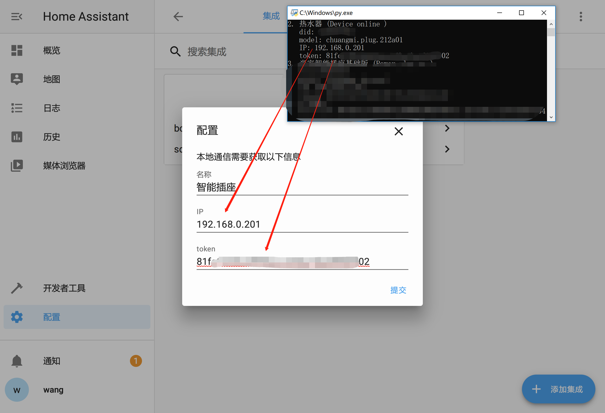
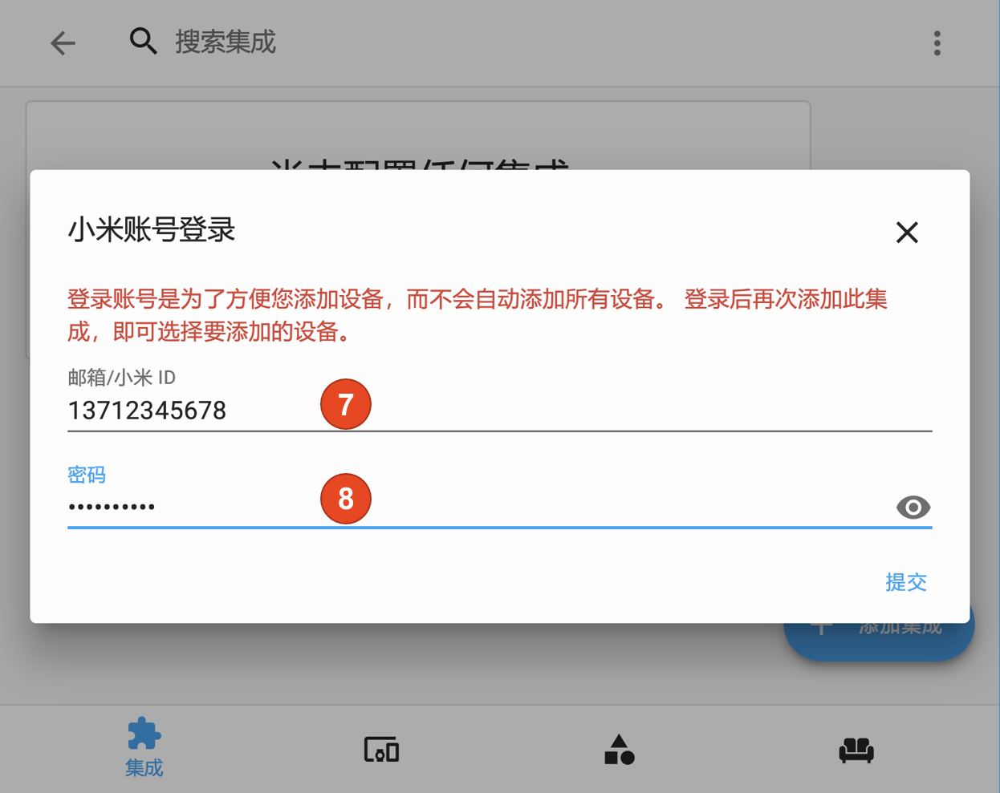

# Xiaomi MIoT

简体中文 | [English](https://github.com/ha0y/xiaomi_miot_raw/blob/add-miot-support/README_en.md)

MIoT 协议是小米智能家居从 2018 年起推行的智能设备通信协议规范，此后凡是可接入米家的设备均通过此协议进行通信。此插件按照 MIoT 协议规范与设备通信，实现对设备的状态读取及控制。

由于 MIoT 协议具有极强的通用性，已接入米家的智能设备均可通过此插件快速高效地接入 Home Assistant，而无关设备的具体型号。

本插件运行方式默认为本地接入(局域网读取/控制)，延迟极低。**对于不支持本地读取的设备，支持 2 种云端接入（云端读取本地控制/云端读取云端控制）。**

目前此插件已支持以下设备类型：
* sensor (传感器)
* switch (开关)
* cover (卷帘/晾衣架/升降帘/窗帘)
* light (灯，可以开关、调亮度、调色、设置灯效)
* fan (风扇，可以开关、设置风速、设置摇头)
* humidifier (加湿器/除湿器，可以开关、设置湿度、选择模式)
* media player (小爱音箱，可以播放/暂停/调音量，上一曲/下一曲，TTS/执行自定义指令)
* climate (空调/空调伴侣/浴霸，可以设定温度、风速、模式)

如果对您有帮助，欢迎给个 Star！ 🌟

如果插件工作不正常，请先参考[调试](https://github.com/ha0y/xiaomi_miot_raw#调试)部分，打开调试日志，通过日志排查问题。

如果您认为插件有 bug，或者有新功能的想法，您可以提交 Issue。
使用上的问题，请在论坛咨询，或加入 QQ 群: **982 100 289**

## 安装

* 将 custom_component 文件夹中的内容拷贝至自己的相应目录

或者
* 在 [HACS](https://hacs.xyz/) 商店中，直接搜索添加“[Xiaomi MIoT](https://github.com/ha0y/xiaomi_miot_raw)”


## 配置

### UI 配置法






### 文件配置法

**请参考 [config_example 文件夹](https://github.com/ha0y/xiaomi_miot_raw/tree/add-miot-support/config_example)** 内的相关文件

各个设备类型公用的配置参数：
- **host** (*Required*): 设备 IP。
- **token** (*Required*): 设备 token。
- **name** (*Optional*): 设备名称。
- **mapping** (*Required*): 设备的功能与 id 的映射。
- **params** (*Optional*): 与 mapping 对应，指定关于属性值的一些信息。
- **scan_interval** (*Optional*): 状态刷新周期。

- **sensor_property** (*Required*，仅限 sensor): 把 mapping 中的哪一个作为传感器的状态。其他的将作为传感器的属性。
- **sensor_unit** (*Optional*，仅限 senso): 传感器单位。

- **update_from_cloud** 从米家服务器读取设备状态。

**mapping** 和 **params** 中的项目具有对应关系。params 是为了指定关于属性值的一些信息。比如说对于 switch_status，它代表开关状态，这一点是确定的；可是有的设备，值为 1 为开，值为 2 为关；有的设备值为 True 为开，值为 False 为关。这就需要在 params 中指定具体的状态值了。又如，蓝牙网关插座，显示的功率数值没有小数点，实际功率要除以 100；而某品牌插座，同样没有小数点，可实际功率要除以 10……这种问题同样可以在 params 中解决。二者的一些选项：

- **switch_status** (*Required* 适用于 light switch fan): 插件通过读写这个属性来获取和控制开关状态。其下的 **power_on** 和 **power_off** 指定开和关的状态值。
- **motor_control** (*Required* 适用于 cover)，插件通过读写这个属性来控制电机状态。其下的 **open**、**close** 和 **stop** 指定升/降/停的状态值。
- **motor_status** (*Optional* 适用于 cover)，插件通过读写这个属性来获取电机状态。其下的 **open**、**close** 和 **stop** 指定升/降/停的状态值。注意这些值可能与上面的控制值不同。
- **brightness** (*Optional* 适用于 light)：设置此项后支持亮度调节。
- **color_temperature** (*Optional* 适用于 light)：设置此项后支持色温调节。
- **oscillate** (*Optional* 适用于 fan)：设置此项后支持摇头。
- **speed** (*Optional* 适用于 fan)：设置此项后支持风速调节。
- **mode** (*Optional* 适用于 light fan)：灯、加湿器等设备的运行模式。

## 更新日志

### 2 月 14 日
1. 支持 climate 设备类型，可以接入空调、空调伴侣等设备了。

### 2 月 9 日
1. 支持传感器自动加单位。
2. 增加小爱“播报指定文本”和“执行指定指令”服务。

### 2 月 8 日
1. 支持小爱音箱从 UI 配置。
2. 支持洗衣机等设备的 action 调用。

### 2 月 6 日
1. 支持小爱音箱。

### 2 月 3 日
1. 支持了一个设备多种类型的自动配置，现在像风扇灯、晾衣架这类具有子设备的设备，可以**自动识别**、**一次性接入**。
2. 由于 1 的原因，插件内部数据存储方式发生较大变化，**部分设备需要删除重新配置，需要重新配置的设备已在通知栏中写明**；文件配置的设备不受影响。
3. 大幅提高了自动识别的准确性。

### 1 月 31 日
1. **现已支持部分设备类型的自动配置。**
2. 修复大量 bug。
3. **支持 humidifier。**

### 1 月 28 日
1. **支持 UI 配置！**

### 1 月 26 日
1. 支持 RGB 灯。

### 1 月 25 日
1. 更新米家服务器请求方法，自动生成设备状态请求。

### 1 月 23 日
1. **支持从米家服务器读取状态，以解决部分设备通过局域网读取时出现 -9999 或 -4004 错误的问题！**
2. 支持 fan 设备类型，可以接入风扇了。

### 1 月 18 日
1. 使调试日志内容更加详细，方便排查问题。

### 1 月 13 日
1. **支持 light 设备类型，可以接入智能灯，并调光调色了！**
2. 支持灯内置的场景色选择

### 1 月 12 日
1. 数值修正的方法变更为 `params` 下 `value_ratio` 配置项。
2. 重构代码，大幅优化代码结构，为扩展设备类型做准备。
3. **本次更新后，涉及本插件的部分实体会重新生成，其 ID 带有后缀 `_2`，原实体不再可用。请删除之前的实体，然后把新实体的实体 ID 修改去除 `_2` 即可，历史记录和原有功能不受影响。**
4. 开关类型的实体在检测到不支持状态反馈后，会创建无状态反馈的实体用于控制。

### 1 月 11 日
1. 现在 switch 也可以像 sensor 一样把设备的属性值显示在 state attribute 中了。此类设备无需再配置 sensor，直接将以前 sensor 配置的 mapping 内容合并进来即可，减少一半的网络请求。
2. ~~针对“小米智能插座2 蓝牙网关版”的功率没有小数点的问题，设计了一个“power_100”的 mapping 对数值进行修正。~~

### 1 月 6 日
1. 支持 cover 设备类型，现在可以接入窗帘、晾衣架等设备了
2. **为了使多种设备的配置文件格式统一、方便后期拓展更多类型的设备，对配置文件格式进行了较大调整，新版本不再兼容以前的格式，请在升级时注意适配**
3. 优化代码结构及调用方式，响应更快了


## 调试
如果组件工作不正常，通过修改配置文件提升日志调试级别:
```yaml
# configuration.yaml

logger:
  default: warn
  logs:
    custom_components.xiaomi_miot_raw: debug
    miio: debug
```
